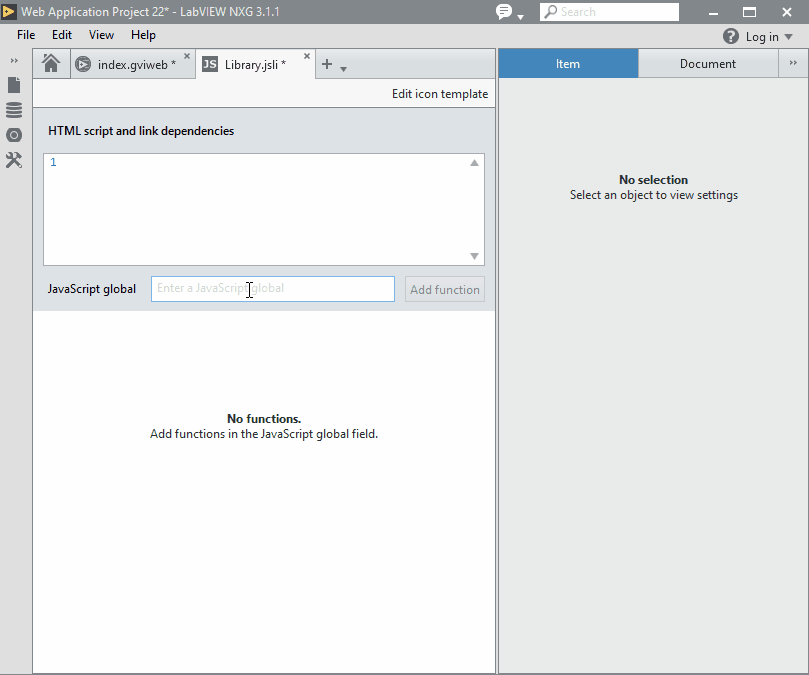
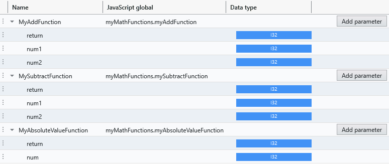

# JSLI Frequently Asked Questions

- [What is the JSLI?](#what-is-the-jsli)

## What is the JSLI?

The JavaScript Library Interface (JSLI) is a document type that allows you to create Block Diagram nodes that call global JavaScript functions in a WebVI.

## Which functions can the JSLI call?

Only functions that are available on the [global object](https://developer.mozilla.org/en-US/docs/Glossary/Global_object) can be called from a JSLI document.

What this means in practice is that **built-in browser JavaScript functions** such as `console.log` may be called directly by a node configured with the JSLI document:



When writing custom JavaScript files to use with the JSLI, it is recommended that you explicity assign **your JavaScript functions** to the global object named `window`.

For example, the contents of `notRecommendedImplicitGlobals.js` may contain:

```js
// notRecommendedImplicitGlobals.js
// counter is implicitly added to global object which is NOT recommended
var counter = 0;

// incrementCounter is explicitly added to global object as recommended
window.incrementCounter = function () {
    return counter++;
};
```
In the above example, `incrementCounter` is explicitly assigned to the global object but `counter` is implicitly assigned to the global object.
The implicit assignment of counter to a global may result in accidentally overwriting an exisiting variable named counter used in other scripts.

A more robust JavaScript file may use the wrapper code template described in the [Preparing Your Code For Use With a JavaScript Library Interface](http://www.ni.com/documentation/en/labview-web-module/latest/manual/prepare-your-js-code/) help topic.

For example, an implementation of `myJavaScriptFunctions.js` using the wrapper code template would look like the following:

```js
// myJavaScriptFunctions.js
(function () {
    'use strict';

    // counter is only accessible to functions in the wrapper
    var counter = 0;

    // incrementCounter is explicitly added to global object
    window.incrementCounter = function () {
        return counter++;
    };
}());
```

The wrapper code template enables [strict mode](https://developer.mozilla.org/en-US/docs/Web/JavaScript/Reference/Strict_mode) which prevents unintentionally assigning properties to the global object.
The example above will only add the `incrementCounter` function to the global object and the `counter` variable will only be accessible to the `incrementCounter` function.

For more details about the wrapper code template see the [Preparing Your Code For Use With a JavaScript Library Interface](http://www.ni.com/documentation/en/labview-web-module/latest/manual/prepare-your-js-code/) help topic.

## How can I expose multiple JavaScript functions and minimize global object pollution?

You can combine several JavaScript functions in a **namespace** to prevent polluting the global object.
Having fewer functions placed directly on the global object reduces the chance of collisions with other JavaScript functions placed on the global object.

You should choose a namespace name that is unlikely to collide with other properties on the global object.

For example, creating a namespace named `myMathFunctions` to add multiple functions:

```js
(function () {
    'use strict';

    const myAddFunction = function (num1, num2) {
        return num1 + num2;
    };

    function mySubtractFunction (num1, num2) {
        return num1 - num2;
    }

    const myAbsoluteValueFunction = num => Math.abs(num);

    window.myMathFunctions = {
        myAddFunction,
        mySubtractFunction,
        myAbsoluteValueFunction
    };
}());
```

The functions in the `myMathFunctions` namespace can be configured in the JSLI document:


In the example above the `JavaScript global` field on the JSLI document includes the namespace of the function.
For example, the value `myMathFunctions.myAddFunction` is entered in the `JavaScript global` field to represent the `myAddFunction` that exists int the `myMathFunctions` namespace.

## What LabVIEW types are supported by the JSLI?

Only the following LabVIEW types are supported by the JSLI:

- Number, Boolean, String
- Array of Number

For Number, only the following types are supported:

- I8, I16, I32, U8, U16, U32
- Single, Double

Notably, the I64, U64, Complex, and Fixed-Point Number types are not supported by the JSLI.

## How are the LabVIEW types represented in JavaScript?

### LabVIEW Boolean

The LabVIEW boolean type will be automatically converted to the JavaScript boolean type.

### LabVIEW Number

The various LabVIEW number types will be automatically converted back and forth to the single JavaScript number type.

> **Note**: JavaScript has a single number type that corresponds to an IEEE 754 Double precision floating point value.
> The JSLI only supports LabVIEW number types that can be losslessly converted to a JavaScript number.

### LabVIEW String

A LabVIEW string will be automatically converted back and forth to the JavaScript string type.
This will convert valid LabVIEW NXG UTF-8 strings to valid JavaScript UTF-16 strings and vice-versa.

> **Note**: Do not attempt to send arbitrary binary back and forth as strings.
> Instead use byte arrays or base64 encode / decode a string.
>
> Invalid LabVIEW NXG UTF-8 strings or invalid UTF-16 JavaScript strings may result in unexpected ouput or errors.

### LabVIEW Number Arrays

The supported LabVIEW number arrays are passed to and from JavaScript as the corresponding JavaScript TypedArrays.

JavaScript TypedArrays are used over ordinary JavaScript Arrays as the JavaScript TypedArray offers performant manipulation of multiple numeric values.

For example: A LabVIEW U8 Array would be passed as a JavaScript Uint8Array TypedArray.

> **Note**: When passing a LabVIEW numeric array as a TypedArray parameter to a JavaScript function, **DO NOT** hold onto and read from the TypedArray after the completion of the JavaScript function (synchronously or asynchronously).
> The TypedArray may be a view directly to the run-time memory and may not be valid after the JavaScript function has completed.
>
> **Note**: When passing a LabVIEW numeric array as a TypedArray parameter to a JavaScript function, only read from the array.
> **DO NOT** write to the array.
> The TypedArray may be a view directly to the run-time memory and may have undefined behavior if written to.

## How can I return multiple values from JavaScript?

JavaScript functions are only capable of returning a single value.
The following are some ways to bundle multiple values into a single return value.

### Multiple number values

For returning multiple number values, consider returning a TypedArray of the values.
For example, to return multiple numbers as an array of doubles:

```js
(function () {
    'use strict';

    window.myFunction = function () {
        var a = 7;
        var b = 8;
        return new Float64Array([a, b, 9]);
    };
}());
```

### Return a mix of values as a JSON string

Serializing values as a string and deserializing from a string is a way to pass multiple values between JavaScript and the WebVI diagram.
Both JavaScript and WebVIs support the JSON format for string serialization and deserialization.

On a WebVI diagram, [Flatten to JSON](http://www.ni.com/documentation/en/labview/latest/node-ref/flatten-to-json/) or [Unflatten from JSON](http://www.ni.com/documentation/en/labview/latest/node-ref/unflatten-from-json/) can be used to convert a value to a JSON string or parse a JSON string respectively.

From JavaScript, the [JSON.stringify](https://developer.mozilla.org/en-US/docs/Web/JavaScript/Reference/Global_Objects/JSON/stringify) and [JSON.parse](https://developer.mozilla.org/en-US/docs/Web/JavaScript/Reference/Global_Objects/JSON/parse) functions can be used to convert a value to a JSON string or parse a JSON string respectively.

<!--

## How can I wait for an asynchronous JavaScript function?

If a function returns a Promise then LabVIEW NXG will wait for the Promise to resolve.

JavaScript has several patterns for asynchronous behavior.

### Promises

Returns the promise directly

### Async functions

Mark the function async. JavaScript will create a Promise for you.

### Callbacks

Wrap a callback as a Promise

## How do you hold onto a JavaScript Object reference?

Create a reference manager to manage the JavaScript object references for you.

### How do you construct a JavaScript Object?

Create a wrapper function to invoke the constructor. Use the JavaScript Object reference pattern to hold onto it for you.

### How do you invoke a method of a JavaScript Object?

Create a wrapper function to invoke the method. Use the JavaScript Object reference pattern to hold onto it for you.

## How do you place a custom visual on a WebVI?

Add a class to a text control.
Find the control using JavaScript.
Replace the content of the control.
Note: This is a workaround. Behavior of text control may change between releases.

## How do you handle a stream of messages or events?

Use cases: listening for events that fire multiple times or streaming data over a custom protocol.
Use DataQueue pattern.
Actually should use Readable Stream and polyfill: https://streams.spec.whatwg.org/#example-rs-push-no-backpressure
-->
